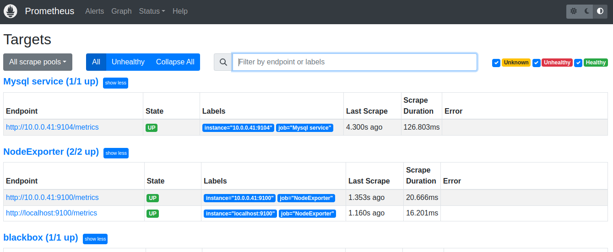

# **Введение**

Цель лабораторной работы провести установку и настройку Prometheus, exporters, алертов. Для выполнения работы используется ПК с установленной операционной системой Ubuntu 22.04.2 LTS. Виртуальные машины будут разворачиваться с помощью vagrant. Настройка осуществляется с помощью ansible. Виртуальный стенд состоит из 2-х машин: CMS (10.0.0.41) и Monitoring (10.0.0.42).

# **1. Установка open source CMS**

В качестве CMS выбран Wordpress. Для установки и настройки написаны роли 'wordpress' и 'mysql', которые устанавливают и настраивают необходимые компоненты. После запуска стенда CMS доступен на порту 8080 хостовой машины.


# **2. Установка exporters для сбора метрик**

Для установки экспортёров созданы роли 'bbox_exporter', 'mysqld_exporter', 'node_exporter'. Экспортёр node_exporter устанавливается на оба хоста стенда. 'bbox_exporter' - роль для установки и настройки экспортёра blackbox. Устанавливается на хост Monitoring и проверяет доступность сервиса http на хосте CMS. Экспортёр 'mysqld_exporter' снимает метрики с базы mysql, устанавливается на хост CMS.

Пример метрик от экспортёра mysqld_exporter:


# **3. Установка и настройка Prometheus**

Установка и настройка Prometheus осуществляется ролью 'prometheus'. Файл конфигурации 'prometheus.yml' расположен в каталоге [GAP-1](./GAP-1/). После запуска стенда Prometheus доступен на порту 9090.


# **4. Установка и настройка Alertmanager**

Для установки и настройки Alertmanager написана роль 'alertmanager' и создан файл конфигурации 'alertmanager.yml'. Файл конфигурации расположен в каталоге [GAP-1](./GAP-1/). Alertmanager доступен на порту 9093 хостовой машины. Для корректной настройки уведомлений в канал Telegram, до запуска стенда, на хостовой машине нужно создать локальные переменные 'BOT_TOKEN' и 'BOT_CHAT_ID' и присвоить им значения bot_token и chat_id.


Для проверки работы уведомлений через Telegram (предполагается, что чат и бот уже созданы) остановим сервис mysqld_exporter на хосте CMS:

```
vagrant ssh CMS
vagrant@CMS:~$ sudo systemctl stop mysqld_exporter
```


Через некоторое время получаем уведомление в Telegram канал:


Снова запустим сервис mysqld_exporter:

```
vagrant@CMS:~$ sudo systemctl start mysqld_exporter
```



Уведомление в Telegram канал о восстановлении сервиса:


# **Итог**

В лабораторной работе проведена установка и настройка Prometheus, экспортёров, Alertmanager. Для этого были созданы и протестированы соответствующие ansible роли. Проведена работа по созданию и настройке бота и чата в Telegram канале, а так же протестирована отсылка уведомлений в случае недоступности какого-либо компонента (на примере mysqld_exporter).